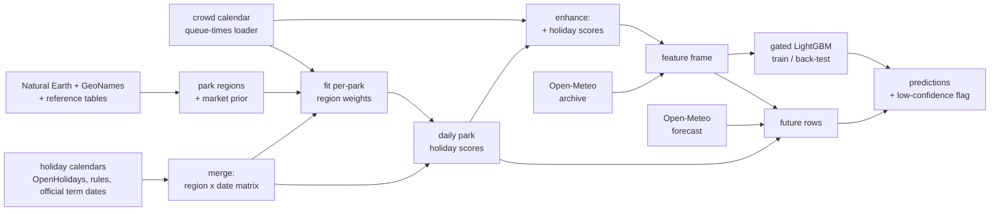

# coaster-crowd-forecast

Forecast how busy a theme park will be on a given day, from its calendar, school and public holidays, weather and its own recent history.

The target is `crowd_percent`: a per-park, rank-normalised 0-100 index of daily crowd level (50 = a typical day for that park, 90 = busier than 90% of its days). Models are LightGBM, one set of trees serving every forecast horizon, with an explicit "low confidence" path for parks that have too little history.

> The crowd data is scraped from queue-times.com by a separate loader and is **not included or redistributable**. Everything runs on a synthetic dataset without it (`crowdcast demo`, the test suite and CI), and the real-data pipeline is documented in [`docs/DATA.md`](docs/DATA.md).

## Results (held-out year, 2025-09-01 to 2026-08-31)

Models are fitted on data up to 2025-08-31 and scored on the following year, chronologically (no random splits). Metric is mean absolute error (MAE) in index points; lower is better.

| Setup | MAE | R² |
|---|---|---|
| Same value every day (global mean) | 24.81 | -0.01 |
| Park x weekday x month average | 21.38 | 0.16 |
| Same weekday last year | 20.67 | 0.09 |
| LightGBM: calendar, holidays, hours, last year (no weather) | 17.20 | 0.42 |
| ...plus same-day weather | 15.87 | 0.49 |
| **Deployed gated model, all 116 parks, long horizon** | **16.00** | 0.49 |
| ...only the 94 parks with at least a year of history | 15.40 | 0.52 |
| ...with labels known through 14 / 7 / 1 days ago | 15.04 / 14.95 / **14.79** | 0.54 / 0.55 / 0.56 |
| ...scored on archived 7-day weather forecasts instead of observed weather | 16.08 | n/a |
| Parks with under a year of history (fallback model, flagged low confidence) | 20.40 | 0.27 |

Read these with the caveats in the [model card](docs/MODEL_CARD.md): one test year, weather features are observed values unless stated, and differences under about 0.05 MAE are noise (see [`docs/RESULTS.md`](docs/RESULTS.md)). What worked, what did not, and why is written up there, including the experiments that showed no gain (moving holidays such as Easter, blending models trained on different data portions).

New here? [`TUTORIAL.md`](TUTORIAL.md) walks through how this was built, including the dead ends and the checks, aimed at ML and software engineers.

## Quickstart (no data needed)

```bash
python -m venv .venv && source .venv/bin/activate
pip install -e ".[dev]"
crowdcast demo        # synthetic data: features -> back-test -> forecast the next days
pytest                # tests run on synthetic data in a few seconds
```

## How it works



* **Holiday scores.** For each park, national and school holidays of each source region are weighted by how much that region feeds the park. Weights start from a distance/population prior and are shrunk toward what the park's own data supports.
* **Features.** Day of week, seasonality, holiday scores and distance to the nearest holiday, opening hours, event flags, weather (same-day plus anomalies against the park's climatology), park identity, last year's level on the same weekday, and recent drift.
* **Gated model.** Parks with at least a year of labelled history use the full model. Others (including parks never seen) use a fallback without park identity or history and every prediction is flagged `low_confidence`.
* **One model, every horizon.** Recent-drift features and weather are randomly blanked during training, so the same trees serve "nothing known", "labels through 14/7/1 days ago" and "no weather beyond the 16-day forecast".
* **Live path = training path.** Future rows are built by the same functions (`DailyScores.holiday_features`, `prior_year_frame`, `derive_weather_features`), and a test rebuilds real days as if they were unknown to check they match.

## Pipeline commands

```
crowdcast parks-build          # regions, park -> region mapping, market prior      (reference/ + data/raw/geo)
python scripts/calendars/{10,20,30,40,50}_*.py   # source holiday calendars (run once, see docs/DATA.md)
crowdcast calendars-merge      # region x date matrices
crowdcast holidays-fit         # per-park region weights (~1 min on 6 cores)
crowdcast holidays-score       # daily park scores
crowdcast enhance              # crowd calendar + holiday columns
crowdcast weather-fetch        # historical weather per park (Open-Meteo, resumable)
crowdcast train                # fit and save the model
crowdcast evaluate             # back-test with the horizon / gate breakdown
crowdcast forecast OUT.csv     # predict the days after the last label, using forecast weather
```

## Layout

```
src/crowdcast/
  data/         input contracts, loaders, synthetic data generator
  features/     calendar, hours/events, history (prior-year, drift), assembly, future-row builder
  weather/      Open-Meteo client (retry, rate limits), archive, forecast, archived forecasts, wx_* features
  scoring/      holiday scores: region x date matrices -> park scores, weight fitting, enhanced calendar
  parks/        regions, park enrichment, market prior
  calendars/    merge of the source calendar tables
  models/       gated LightGBM model, config, comparison zoo
  evaluation/   time splits, metrics, back-tests, scoring on archived forecast weather
  pipeline.py   glue between files and the pure functions;  cli.py  command line
scripts/calendars/   hand-curated holiday-table builders (run rarely; see docs/DATA.md)
experiments/         scripts behind docs/RESULTS.md
reference/           small curated tables that are part of the method (tiers, populations, coordinate fixes)
tests/  docs/  configs/
```

## Testing

`pytest` runs on synthetic data only (about 90 tests, a few seconds, roughly 94% line coverage). It covers the leakage guarantees (perturb the future, assert features and predictions do not move), model routing and the low-confidence gate, the Open-Meteo retry and rate-limit logic against a fake transport, the weight-fitting maths (a planted signal is recovered, pure noise earns no out-of-fold skill), the calendar merge and geography builders on tiny hand-made inputs, and the file-based pipeline and CLI on a synthetic data directory. What is not covered is mainly the thin wrappers that need the real geodata.

The ported pipeline was also checked against the research-phase outputs on the real data: features, weather features, calendar matrices, park regions, market prior, holiday weights and back-test numbers all reproduce (see `docs/RESULTS.md` for the one place where rounding moves a headline by 0.04 MAE).

## Development

```bash
make check    # ruff lint + format check, mypy, pytest (also what CI runs)
```

## Data and licences

Code is MIT ([LICENSE](LICENSE)). No third-party data is committed, and the MIT licence does not cover any data you download or derive. Inputs come from queue-times.com (via the loader), Open-Meteo, OpenHolidays, GeoNames, Natural Earth and the `holidays` package; [`NOTICE.md`](NOTICE.md) lists each source's terms (attribution, Open-Meteo's non-commercial limit, OpenHolidays' ODbL share-alike) and [`docs/DATA.md`](docs/DATA.md) covers what is fetched and why the crowd data is excluded. Forecasts are estimates without warranty.

Powered by [Queue-Times.com](https://queue-times.com/). Weather data by [Open-Meteo.com](https://open-meteo.com/). Independent project, not affiliated with Queue-Times.com, Open-Meteo or any park or operator.
